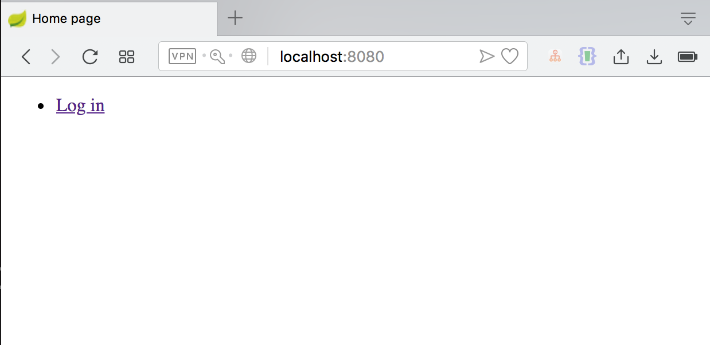
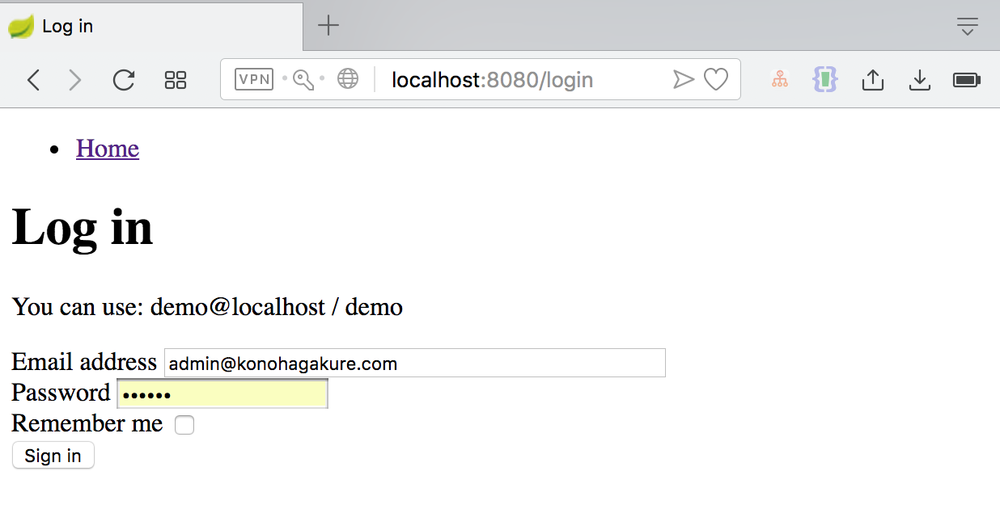
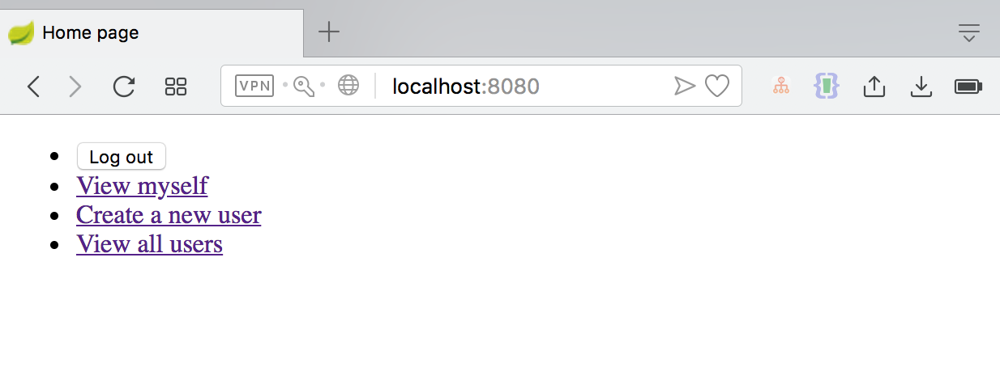
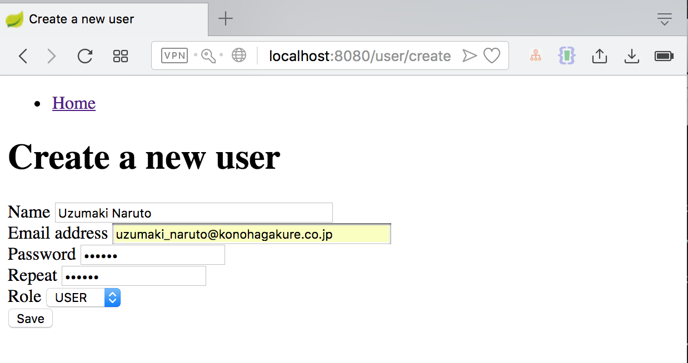
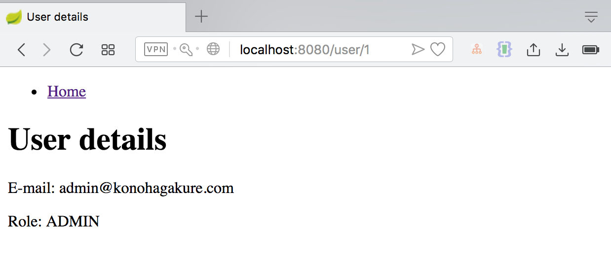
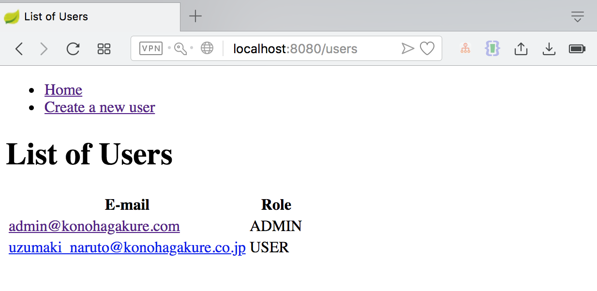

# Spring Boot Security App

Open your terminal :

`mvn clean spring-boot:run`

Open yur browser :

`http://localhost:8080/`

Use this account :

`email : admin@konohagakure.com`

`password : 123`

Index Page

Login Page

List Menu Page

Create New User Page

View User Details

List Users Page

